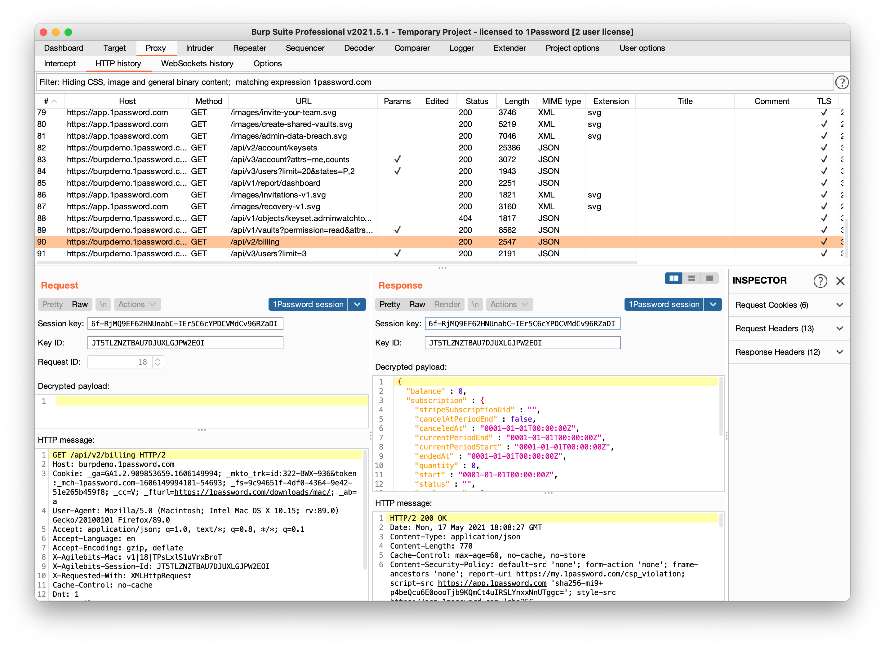

# 1Password session analyzer plugin for Burp Suite

This repository contains a [Burp](https://portswigger.net/burp) plugin that adds a special message editor view to Burp to analyze and edit requests made to 1Password.com.

## What is this for?

As we say in our [bounty brief](https://bugcrowd.com/agilebits), 1Password is not your regular web application. The first time security researchers open their HTTP proxy of choice when testing 1Password.com, they soon notice that this does not look like a regular web app at all. Rather than regular HTML or JSON, the server returns opaque blobs of content. When the 1Password.com web app sends a payload to the server, it is also an opaque blob, and any request you tamper with in the slightest returns an error.

This behavior is the result of the security features of 1Password.com. We require every request and response that are specific to a 1Password account to be protected by the account's master password and secret key, which means every bit of data that gets sent is encrypted, and every request is authenticated.

### Nice, but this makes bug hunting really hard!
It does! Using common tools to find security bugs on web applications really does not work well on 1Password.com. If you want to do any sort of legitimate inspection of 1Password.com - while fully knowing the master password and secret key for your account - you'll need some extra tools.

In order to make bug hunting with 1Password.com a lot easier, we are publishing this Burp plugin to help you analyze and modify requests sent between the 1Password.com web application and server as long as you have a valid session key. The next section dives into how session management with 1Password.com works.

### Encrypting payloads
At 1Password we want to make one thing very sure: no one should be able to access your data, without your master password and secret key. That applies to the vault data stored on your computer or phone, and to the data that we store on our servers. It also applies to any network infrastructure that sits between you and the 1Password servers. Proxy servers sitting between you and 1Password.com should not be able to see what you do with your 1Password account, even if they manage to break TLS.

Therefore, when you log in to 1Password.com or any of the 1Password apps, we use a Password Authenticated Key Exchange (PAKE) to derive what we call a session key. At this time, we use a modified version of the Secure Remote Password Protocol (SRP) as our PAKE. This derived session key is used to add an additional layer of encryption on top of the TLS we use for all requests.

Our APIs are all JSON-based, and all JSON payloads are encrypted using (at the time of writing) an AES256 GCM based cipher. This is wrapped in another JSON payload, which are the blobs being sent to and received from 1Password.com. Since the session key derives directly from your master password and secret key, having access to the session key is the equivalent to knowing your master password and secret key.


### Authenticating requests
Once you are able to successfully encrypt and decrypt messages with the session key, you'll soon notice that whenever you modify your message the server still rejects your requests. What is going on?

There is a separate mechanism protecting requests, the request MAC. Every request 1Password clients send to the server includes a request header named X-Agilebits-Request-MAC, which is of the form `v1|25|8MPu848dH2kKdVRa`. The three components of this request MAC are a version indicator (always v1 right now), an incrementing request identifier and 12 bytes encoded as base64 that is a truncated message authentication code.

The request MAC ensures that certain properties of the request can only be generated by a client. Since the request MAC stores a counter of which request was made to the server, which the server verifies, it prevents replaying encrypted messages. As an aside, this also categorically prevents cross site request forgery, as making any request to your account requires some access to the session key locally.

The request MAC value is derived using the following process:
```
authString := sessionId || "|" || requestMethod || "|" || url || versionIndicator || requestId
derivationKey := HMAC(sessionKey, "He never wears a Mac, in the pouring rain. Very strange.")
mac := HMAC(authString, derivationKey)
headerValue := base64url(mac[0:12])
```
The HMAC algorithm currently used for v1 is HMAC-SHA256.

## Using this plugin

The Burp plugin works with Burp's message editor and contains its own custom implementation of 1Password.com's session management protocol. You activate it by loading the JAR file in Burp's extender tab, like any other Burp plugin.

When activated, it provides a number of inputs, such as an input for the original HTTP message, and an input for the decrypted payload (if present). It also provides a way to edit the request identifier, the key identifier and the session key itself. Inputting the correct session key will automatically decrypt the message and allow you to inspect and modify payloads and requests.

**Please note:** The Burp plugin contains automatic detection of 1Password session data. It's only available on sessions with 1Password.com, and cannot be activated on sessions that don't contain 1Password session data.



Since this Burp plugin is for the Burp message editor, it can be used only in the following places in Burp:

* Proxy -> Intercept
* Proxy -> HTTP history
* Repeater

### How do I obtain the session key?
You might wonder how you obtain the session key from your session on 1Password.com. Here we are going to ask you to do a little homework yourself. You will probably understand we can not provide a stable way of getting access to your own session key, but you can probably find the session key yourself by knowing that we use [standard JavaScript APIs](https://developer.mozilla.org/en-US/docs/Web/API/SubtleCrypto) to do the encryption in the 1Password frontend.

## How to build yourself

Make sure you to install Java 17 on your computer. E.g. to install the Eclipse Foundation's OpenJDK 17, on a Mac with Homebrew, run:
```shell
brew tap homebrew/cask-versions
brew install temurin17
```

`./gradlew fatJar` builds this plugin and puts the resulting JAR file in `build/libs`.

## How to debug
To be able to connect a Java debugger to your Burp plugin, you must manually start Burp from your command line. On a Mac, run:

```sh
java -agentlib:jdwp=transport=dt_socket,server=y,suspend=n,address='*:5005' -jar /Applications/Burp\ Suite\ Community\ Edition.app/Contents/java/app/burpsuite_community.jar
```

You can now connect your debugger on local port 5005. For example, in IntelliJ IDEA you can add a _Remote JVM debugger_ configuration with the following command line configured: `-agentlib:jdwp=transport=dt_socket,server=y,suspend=n,address=*:5005`

## How to test
Run the tests using `./gradlew test`. The test output results are in `build/test-results`.